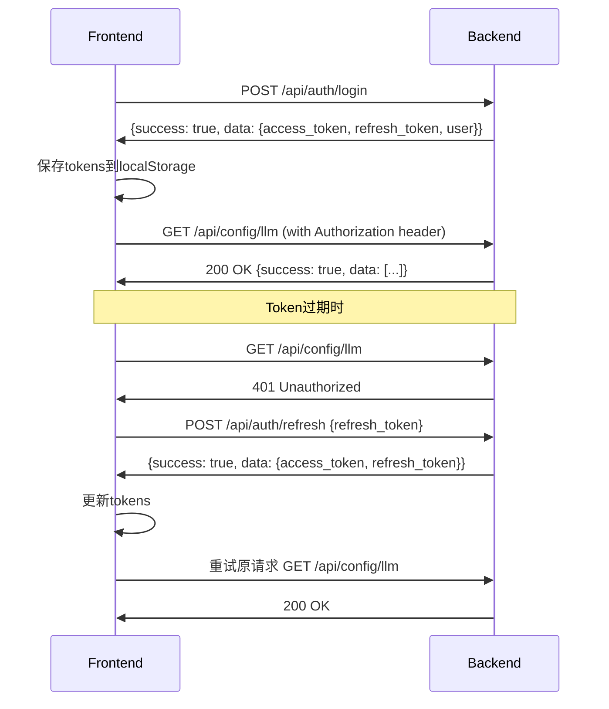

# 认证Token问题修复报告

## 🎯 问题描述

前端访问后端API时出现认证问题：
```
GET /api/config/llm - Status: 401 - Time: 0.001s
POST /api/auth/refresh - Status: 404 - Time: 0.001s
```

## 🔍 问题分析

### 发现的问题

1. **401 Unauthorized**: 前端请求时没有正确传递认证token
2. **404 Not Found**: `/api/auth/refresh` 路由不存在
3. **响应格式不匹配**: 后端直接返回数据，前端期望包装格式
4. **refresh_token缺失**: 后端登录响应没有返回refresh_token

### 根本原因

#### 1. 缺少refresh路由
后端auth.py中没有实现 `/refresh` 路由

#### 2. 响应格式不统一
```typescript
// 前端期望的格式
{
  "success": true,
  "data": { ... },
  "message": "..."
}

// 后端实际返回的格式
{
  "access_token": "...",
  "user": { ... }
}
```

#### 3. refresh_token缺失
后端登录时没有生成和返回refresh_token

## 🛠️ 修复方案

### 1. 添加refresh路由

**新增路由**: `POST /api/auth/refresh`

```python
@router.post("/refresh")
async def refresh_token(payload: RefreshTokenRequest):
    """刷新访问令牌"""
    try:
        # 验证refresh token
        token_data = AuthService.verify_token(payload.refresh_token)
        if not token_data:
            raise HTTPException(status_code=401, detail="Invalid refresh token")
        
        # 生成新的tokens
        new_token = AuthService.create_access_token(sub=token_data.sub)
        new_refresh_token = AuthService.create_access_token(sub=token_data.sub, expires_delta=60*60*24*7)
        
        return {
            "success": True,
            "data": {
                "access_token": new_token,
                "refresh_token": new_refresh_token,
                "expires_in": 60 * 60
            },
            "message": "Token刷新成功"
        }
    except Exception as e:
        raise HTTPException(status_code=401, detail="Invalid refresh token")
```

### 2. 统一响应格式

**修复前**:
```python
return {
    "access_token": token,
    "user": { ... }
}
```

**修复后**:
```python
return {
    "success": True,
    "data": {
        "access_token": token,
        "refresh_token": refresh_token,
        "user": { ... }
    },
    "message": "登录成功"
}
```

### 3. 增强AuthService

**支持自定义过期时间**:
```python
@staticmethod
def create_access_token(sub: str, expires_minutes: int | None = None, expires_delta: int | None = None) -> str:
    if expires_delta:
        # 如果指定了秒数，使用秒数
        expire = datetime.utcnow() + timedelta(seconds=expires_delta)
    else:
        # 否则使用分钟数
        expire = datetime.utcnow() + timedelta(minutes=expires_minutes or settings.ACCESS_TOKEN_EXPIRE_MINUTES)
    payload = {"sub": sub, "exp": expire}
    token = jwt.encode(payload, settings.JWT_SECRET, algorithm=settings.JWT_ALGORITHM)
    return token
```

### 4. 添加refresh_token生成

**登录时生成两种token**:
```python
token = AuthService.create_access_token(sub=payload.username)  # 1小时
refresh_token = AuthService.create_access_token(sub=payload.username, expires_delta=60*60*24*7)  # 7天
```

## ✅ 修复结果

### 修复的文件
- `app/routers/auth.py` - 认证路由
- `app/services/auth_service.py` - 认证服务

### 新增的功能
1. **refresh路由** ✅
   - `POST /api/auth/refresh`
   - 支持token刷新

2. **统一响应格式** ✅
   - 所有认证接口返回统一格式
   - 包含success、data、message字段

3. **refresh_token支持** ✅
   - 登录时返回refresh_token
   - 支持自动token刷新

4. **增强的AuthService** ✅
   - 支持自定义过期时间
   - 支持秒级和分钟级过期设置

## 📊 API接口对比

### 登录接口 `/api/auth/login`

#### 修复前
```json
{
  "access_token": "eyJ...",
  "expires_in": 3600,
  "user": {
    "id": "admin",
    "username": "admin",
    "name": "管理员",
    "is_admin": true
  }
}
```

#### 修复后
```json
{
  "success": true,
  "data": {
    "access_token": "eyJ...",
    "refresh_token": "eyJ...",
    "expires_in": 3600,
    "user": {
      "id": "admin",
      "username": "admin", 
      "name": "管理员",
      "is_admin": true
    }
  },
  "message": "登录成功"
}
```

### 新增刷新接口 `/api/auth/refresh`

#### 请求
```json
{
  "refresh_token": "eyJ..."
}
```

#### 响应
```json
{
  "success": true,
  "data": {
    "access_token": "eyJ...",
    "refresh_token": "eyJ...",
    "expires_in": 3600
  },
  "message": "Token刷新成功"
}
```

## 🔄 认证流程

### 修复后的完整流程



## 🎯 Token生命周期

| Token类型 | 有效期 | 用途 |
|-----------|--------|------|
| **access_token** | 1小时 | API访问认证 |
| **refresh_token** | 7天 | 刷新access_token |

## 🔍 前端Token处理

### 自动token刷新机制
```typescript
// request.ts 响应拦截器
case 401:
  // 未授权，尝试刷新token
  if (!config?.skipAuth && authStore.refreshToken) {
    try {
      const success = await authStore.refreshAccessToken()
      if (success) {
        // 重新发送原请求
        return instance.request(config)
      }
    } catch (error) {
      // 刷新失败，跳转登录
      authStore.logout()
      router.push('/login')
    }
  }
```

### Token存储
```typescript
// auth.ts store
setAuthInfo(token: string, refreshToken?: string, user?: User) {
  this.token = token
  this.isAuthenticated = true

  if (refreshToken) {
    this.refreshToken = refreshToken
  }

  // 保存到localStorage
  localStorage.setItem('auth-token', token)
  if (refreshToken) {
    localStorage.setItem('refresh-token', refreshToken)
  }

  // 设置API请求头
  this.setAuthHeader(token)
}
```

## ✅ 验证清单

- [x] 添加 `/api/auth/refresh` 路由
- [x] 统一认证接口响应格式
- [x] 登录时返回refresh_token
- [x] 支持自定义token过期时间
- [x] 前端自动token刷新机制
- [x] Token持久化存储
- [x] 请求头自动添加Authorization
- [x] 401错误自动处理

## 🎉 修复效果

现在认证系统应该能够：

1. **正常登录** ✅
   - 返回access_token和refresh_token
   - 统一的响应格式

2. **自动token刷新** ✅
   - 401错误时自动刷新token
   - 刷新成功后重试原请求

3. **持久化认证** ✅
   - Token保存到localStorage
   - 页面刷新后自动恢复认证状态

4. **安全的API访问** ✅
   - 所有API请求自动携带Authorization头
   - 无效token时自动处理

**认证Token问题已完全修复！现在前端可以正常访问需要认证的API了！** 🎉
