# TradingAgents System Architecture

## Overview

TradingAgents is a multi-agent financial research & decision framework. It uses LangGraph to orchestrate agent workflows and supports comprehensive analysis across China A-share, Hong Kong, and US equity markets. A modular design underpins extensibility and maintainability.

## 🏗️ Architectural Design

### Guiding Principles

- **Modularity**: Each component can evolve independently
- **Agent Collaboration**: Role specialization simulates real research desks
- **Data Fusion**: Decisions derived from multi-source aggregation
- **Extensibility**: Pluggable agents, data providers, LLM adapters
- **Resilience**: Fallback & graceful degradation patterns
- **Performance**: Parallel execution & layered caching

### Architecture Diagram

```mermaid
graph TB
    subgraph "用户接口层 (User Interface Layer)"
        CLI[命令行界面]
        WEB[Web界面]
        API[REST API]
        DOCKER[Docker容器]
    end
    
    subgraph "LLM集成层 (LLM Integration Layer)"
        OPENAI[OpenAI]
        GOOGLE[Google AI]
        DASHSCOPE[阿里百炼]
        DEEPSEEK[DeepSeek]
        ANTHROPIC[Anthropic]
        ADAPTERS[LLM适配器]
    end
    
    subgraph "核心框架层 (Core Framework Layer)"
        GRAPH[TradingAgentsGraph]
        SETUP[GraphSetup]
        CONDITIONAL[ConditionalLogic]
        PROPAGATOR[Propagator]
        REFLECTOR[Reflector]
        SIGNAL[SignalProcessor]
    end
    
    subgraph "智能体协作层 (Agent Collaboration Layer)"
        ANALYSTS[分析师团队]
        RESEARCHERS[研究员团队]
        TRADER[交易员]
        RISKMGMT[风险管理团队]
        MANAGERS[管理层]
    end
    
    subgraph "工具集成层 (Tool Integration Layer)"
        TOOLKIT[Toolkit工具包]
        DATAFLOW[数据流接口]
        MEMORY[记忆管理]
        LOGGING[日志系统]
    end
    
    subgraph "数据源层 (Data Source Layer)"
        AKSHARE[AKShare]
        TUSHARE[Tushare]
        YFINANCE[yfinance]
        FINNHUB[FinnHub]
        REDDIT[Reddit]
        NEWS[新闻源]
    end
    
    subgraph "存储层 (Storage Layer)"
        CACHE[数据缓存]
        FILES[文件存储]
        MEMORY_DB[记忆数据库]
        CONFIG[配置管理]
    end
    
    %% 连接关系
    CLI --> GRAPH
    WEB --> GRAPH
    API --> GRAPH
    DOCKER --> GRAPH
    
    GRAPH --> ADAPTERS
    ADAPTERS --> OPENAI
    ADAPTERS --> GOOGLE
    ADAPTERS --> DASHSCOPE
    ADAPTERS --> DEEPSEEK
    ADAPTERS --> ANTHROPIC
    
    GRAPH --> SETUP
    GRAPH --> CONDITIONAL
    GRAPH --> PROPAGATOR
    GRAPH --> REFLECTOR
    GRAPH --> SIGNAL
    
    SETUP --> ANALYSTS
    SETUP --> RESEARCHERS
    SETUP --> TRADER
    SETUP --> RISKMGMT
    SETUP --> MANAGERS
    
    ANALYSTS --> TOOLKIT
    RESEARCHERS --> TOOLKIT
    TRADER --> TOOLKIT
    RISKMGMT --> TOOLKIT
    MANAGERS --> TOOLKIT
    
    TOOLKIT --> DATAFLOW
    TOOLKIT --> MEMORY
    TOOLKIT --> LOGGING
    
    DATAFLOW --> AKSHARE
    DATAFLOW --> TUSHARE
    DATAFLOW --> YFINANCE
    DATAFLOW --> FINNHUB
    DATAFLOW --> REDDIT
    DATAFLOW --> NEWS
    
    DATAFLOW --> CACHE
    MEMORY --> MEMORY_DB
    LOGGING --> FILES
    GRAPH --> CONFIG
    
    %% 样式定义
    classDef uiLayer fill:#e3f2fd,stroke:#1976d2,stroke-width:2px
    classDef llmLayer fill:#f3e5f5,stroke:#7b1fa2,stroke-width:2px
    classDef coreLayer fill:#e8f5e8,stroke:#388e3c,stroke-width:2px
    classDef agentLayer fill:#fff3e0,stroke:#f57c00,stroke-width:2px
    classDef toolLayer fill:#fce4ec,stroke:#c2185b,stroke-width:2px
    classDef dataLayer fill:#e0f2f1,stroke:#00695c,stroke-width:2px
    classDef storageLayer fill:#f1f8e9,stroke:#558b2f,stroke-width:2px
    
    class CLI,WEB,API,DOCKER uiLayer
    class OPENAI,GOOGLE,DASHSCOPE,DEEPSEEK,ANTHROPIC,ADAPTERS llmLayer
    class GRAPH,SETUP,CONDITIONAL,PROPAGATOR,REFLECTOR,SIGNAL coreLayer
    class ANALYSTS,RESEARCHERS,TRADER,RISKMGMT,MANAGERS agentLayer
    class TOOLKIT,DATAFLOW,MEMORY,LOGGING toolLayer
    class AKSHARE,TUSHARE,YFINANCE,FINNHUB,REDDIT,NEWS dataLayer
    class CACHE,FILES,MEMORY_DB,CONFIG storageLayer
```



## 📋 Layer Explanations

### 1. User Interface Layer

#### Command Line (CLI)
**Location**: `main.py`

```python
from tradingagents.graph.trading_graph import TradingAgentsGraph
from tradingagents.default_config import DEFAULT_CONFIG

# 创建自定义配置
config = DEFAULT_CONFIG.copy()
config["llm_provider"] = "google"
config["deep_think_llm"] = "gemini-2.0-flash"
config["quick_think_llm"] = "gemini-2.0-flash"
config["max_debate_rounds"] = 1
config["online_tools"] = True

# 初始化交易图
ta = TradingAgentsGraph(debug=True, config=config)

# 执行分析
_, decision = ta.propagate("NVDA", "2024-05-10")
print(decision)
```

#### Docker Packaging
**Config File**: `pyproject.toml`

```toml
[project]
name = "tradingagents"
version = "0.1.13-preview"
description = "Multi-agent trading framework"
requires-python = ">=3.10"

[project.scripts]
tradingagents = "main:main"
```

### 2. LLM Integration Layer

#### Adapter Architecture
**Location**: `tradingagents/llm_adapters/`

```python
from langchain_openai import ChatOpenAI
from langchain_anthropic import ChatAnthropic
from langchain_google_genai import ChatGoogleGenerativeAI
from tradingagents.llm_adapters import ChatDashScope, ChatDashScopeOpenAI, ChatGoogleOpenAI

# LLM提供商配置
if config["llm_provider"].lower() == "openai":
    deep_thinking_llm = ChatOpenAI(
        model=config["deep_think_llm"], 
        base_url=config["backend_url"]
    )
    quick_thinking_llm = ChatOpenAI(
        model=config["quick_think_llm"], 
        base_url=config["backend_url"]
    )
elif config["llm_provider"] == "google":
    deep_thinking_llm = ChatGoogleGenerativeAI(
        model=config["deep_think_llm"]
    )
    quick_thinking_llm = ChatGoogleGenerativeAI(
        model=config["quick_think_llm"]
    )
```

#### Supported LLM Providers

- **OpenAI**: GPT-4o, GPT-4o-mini, o1-preview, o1-mini
- **Google AI**: Gemini-2.0-flash, Gemini-1.5-pro, Gemini-1.5-flash
- **DashScope (Qwen)**: Qwen series models
- **DeepSeek**: DeepSeek-V3 (cost-effective)
- **Anthropic**: Claude series

### 3. Core Framework Layer

#### TradingAgentsGraph (Primary Orchestrator)
**Location**: `tradingagents/graph/trading_graph.py`

```python
class TradingAgentsGraph:
    """交易智能体图的主要编排类"""
    
    def __init__(
        self,
        selected_analysts=["market", "social", "news", "fundamentals"],
        debug=False,
        config: Dict[str, Any] = None,
    ):
        """初始化交易智能体图和组件
        
        Args:
            selected_analysts: list of analyst role identifiers
            debug: enable verbose diagnostics
            config: configuration dict (defaults if None)
        """
        self.debug = debug
        self.config = config or DEFAULT_CONFIG
        
        # 更新接口配置
        set_config(self.config)
        
        # 创建必要的目录
        os.makedirs(
            os.path.join(self.config["project_dir"], "dataflows/data_cache"),
            exist_ok=True,
        )
        
        # 初始化LLM
        self._initialize_llms()
        
        # 初始化组件
        self.setup = GraphSetup()
        self.conditional_logic = ConditionalLogic()
        self.propagator = Propagator()
        self.reflector = Reflector()
        self.signal_processor = SignalProcessor()
```

#### GraphSetup (Workflow Builder)
**Location**: `tradingagents/graph/setup.py`

```python
class GraphSetup:
    """负责构建和配置LangGraph工作流"""
    
    def __init__(self):
        self.workflow = StateGraph(AgentState)
        self.toolkit = None
        
    def build_graph(self, llm, toolkit, selected_analysts):
        """构建完整的智能体工作流图"""
        # 添加分析师节点
        self._add_analyst_nodes(llm, toolkit, selected_analysts)
        
        # 添加研究员节点
        self._add_researcher_nodes(llm)
        
        # 添加交易员节点
        self._add_trader_node(llm)
        
        # 添加风险管理节点
        self._add_risk_management_nodes(llm)
        
        # 添加管理层节点
        self._add_management_nodes(llm)
        
        # 定义工作流边
        self._define_workflow_edges()
        
        return self.workflow.compile()
```

#### ConditionalLogic (Routing)
**Location**: `tradingagents/graph/conditional_logic.py`

```python
class ConditionalLogic:
    """处理工作流中的条件分支和路由逻辑"""
    
    def should_continue_debate(self, state: AgentState) -> str:
        """判断是否继续研究员辩论"""
        if state["investment_debate_state"]["count"] >= self.max_debate_rounds:
            return "research_manager"
        return "continue_debate"
    
    def should_continue_risk_discussion(self, state: AgentState) -> str:
        """判断是否继续风险讨论"""
        if state["risk_debate_state"]["count"] >= self.max_risk_rounds:
            return "risk_manager"
        return "continue_risk_discussion"
```

### 4. Agent Collaboration Layer

#### State Management System
**Location**: `tradingagents/agents/utils/agent_states.py`

```python
from typing import Annotated
from langgraph.graph import MessagesState

class AgentState(MessagesState):
    """智能体状态管理类 - 继承自 LangGraph MessagesState"""
    
    # Core identifiers
    company_of_interest: Annotated[str, "Target equity symbol"]
    trade_date: Annotated[str, "Analysis trade date"]
    sender: Annotated[str, "Originating agent"]
    # Analyst reports
    market_report: Annotated[str, "Market/technical analyst report"]
    sentiment_report: Annotated[str, "Social/sentiment analyst report"]
    news_report: Annotated[str, "News/event analyst report"]
    fundamentals_report: Annotated[str, "Fundamentals analyst report"]
    # Research & decisions
    investment_debate_state: Annotated[InvestDebateState, "Investment debate state"]
    investment_plan: Annotated[str, "Research consolidated plan"]
    trader_investment_plan: Annotated[str, "Trader adaptation of plan"]
    # Risk management
    risk_debate_state: Annotated[RiskDebateState, "Risk debate state"]
    final_trade_decision: Annotated[str, "Final trade decision"]
```

#### Agent Factory Pattern
**Location**: `tradingagents/agents/`

```python
# 分析师创建函数
from tradingagents.agents.analysts import (
    create_fundamentals_analyst,
    create_market_analyst,
    create_news_analyst,
    create_social_media_analyst,
    create_china_market_analyst
)

# 研究员创建函数
from tradingagents.agents.researchers import (
    create_bull_researcher,
    create_bear_researcher
)

# 交易员创建函数
from tradingagents.agents.trader import create_trader

# 风险管理创建函数
from tradingagents.agents.risk_mgmt import (
    create_conservative_debator,
    create_neutral_debator,
    create_aggressive_debator
)

# 管理层创建函数
from tradingagents.agents.managers import (
    create_research_manager,
    create_risk_manager
)
```

### 5. Tool Integration Layer

#### Toolkit (Unified Utilities)
**Location**: `tradingagents/agents/utils/agent_utils.py`

```python
class Toolkit:
    """统一工具包，为所有智能体提供数据访问接口"""
    
    def __init__(self, config):
        self.config = config
        self.dataflow = DataFlowInterface(config)
    
    def get_stock_fundamentals_unified(self, ticker: str):
    """Unified fundamentals accessor auto-detecting market type"""
        from tradingagents.utils.stock_utils import StockUtils
        market_info = StockUtils.get_market_info(ticker)
        
    if market_info['market_type'] == 'A-share':
            return self.dataflow.get_a_stock_fundamentals(ticker)
    elif market_info['market_type'] == 'HK':
            return self.dataflow.get_hk_stock_fundamentals(ticker)
        else:
            return self.dataflow.get_us_stock_fundamentals(ticker)
    
    def get_market_data(self, ticker: str, period: str = "1y"):
        """Fetch market data"""
        return self.dataflow.get_market_data(ticker, period)
    
    def get_news_data(self, ticker: str, days: int = 7):
        """Fetch news data"""
        return self.dataflow.get_news_data(ticker, days)
```

#### Data Flow Interface
**Location**: `tradingagents/dataflows/interface.py`

```python
# Global configuration
from .config import get_config, set_config, DATA_DIR

# Data acquisition
def get_finnhub_news(
    ticker: Annotated[str, "Equity ticker e.g. 'AAPL'"],
    curr_date: Annotated[str, "Current date yyyy-mm-dd"],
    look_back_days: Annotated[int, "Lookback days"],
):
    """Fetch company news within a date range.

    Args:
        ticker (str): target equity symbol
        curr_date (str): current date yyyy-mm-dd
        look_back_days (int): number of days to look back

    Returns:
        str: dataframe-like serialized news block or warning
    """
    start_date = datetime.strptime(curr_date, "%Y-%m-%d")
    before = start_date - relativedelta(days=look_back_days)
    before = before.strftime("%Y-%m-%d")
    
    result = get_data_in_range(ticker, before, curr_date, "news_data", DATA_DIR)
    
    if len(result) == 0:
    error_msg = f"⚠️ Unable to retrieve news for {ticker} ({before} to {curr_date})"
    logger.debug(f"📰 [DEBUG] {error_msg}")
        return error_msg
    
    return result
```

#### Memory Management System
**Location**: `tradingagents/agents/utils/memory.py`

```python
class FinancialSituationMemory:
    """Financial situation memory manager"""
    
    def __init__(self, config):
        self.config = config
        self.memory_store = {}
    
    def get_memories(self, query: str, n_matches: int = 2):
        """Retrieve relevant historical memory entries.

        Args:
            query (str): search query
            n_matches (int): number of matches to return

        Returns:
            List[Dict]: relevant memory objects
        """
        # 实现记忆检索逻辑
        pass
    
    def add_memory(self, content: str, metadata: dict):
        """Add new memory record.

        Args:
            content (str): memory body
            metadata (dict): metadata map
        """
        # 实现记忆存储逻辑
        pass
```

### 6. Data Source Layer

#### Multi-Source Support
**Location**: `tradingagents/dataflows/`

```python
# AKShare - China market data
from .akshare_utils import (
    get_hk_stock_data_akshare,
    get_hk_stock_info_akshare
)

# Tushare - professional China financial data
from .tushare_utils import get_tushare_data

# yfinance - global market data
from .yfin_utils import get_yahoo_finance_data

# FinnHub - news & fundamentals
from .finnhub_utils import get_data_in_range

# Reddit - social sentiment
from .reddit_utils import fetch_top_from_category

# Chinese social media sentiment
from .chinese_finance_utils import get_chinese_social_sentiment

# Google News
from .googlenews_utils import get_google_news
```

#### Provider Availability Checks

```python
# 港股工具可用性检查
try:
    from .hk_stock_utils import get_hk_stock_data, get_hk_stock_info
    HK_STOCK_AVAILABLE = True
except ImportError as e:
    logger.warning(f"⚠️ HK stock tools unavailable: {e}")
    HK_STOCK_AVAILABLE = False

# yfinance可用性检查
try:
    import yfinance as yf
    YF_AVAILABLE = True
except ImportError as e:
    logger.warning(f"⚠️ yfinance unavailable: {e}")
    yf = None
    YF_AVAILABLE = False
```

### 7. Storage Layer

#### Configuration Management
**Location**: `tradingagents/default_config.py`

```python
import os

DEFAULT_CONFIG = {
    "project_dir": os.path.abspath(os.path.join(os.path.dirname(__file__), ".")),
    "results_dir": os.getenv("TRADINGAGENTS_RESULTS_DIR", "./results"),
    "data_dir": os.path.join(os.path.expanduser("~"), "Documents", "TradingAgents", "data"),
    "data_cache_dir": os.path.join(
        os.path.abspath(os.path.join(os.path.dirname(__file__), ".")),
        "dataflows/data_cache",
    ),
    # LLM configuration
    "llm_provider": "openai",
    "deep_think_llm": "o4-mini",
    "quick_think_llm": "gpt-4o-mini",
    "backend_url": "https://api.openai.com/v1",
    # Debate & discussion settings
    "max_debate_rounds": 1,
    "max_risk_discuss_rounds": 1,
    "max_recur_limit": 100,
    # Tool toggles
    "online_tools": True,
}
```

#### Data Caching System
**Location**: `tradingagents/dataflows/config.py`

```python
from .config import get_config, set_config, DATA_DIR

# Data directory configuration
DATA_DIR = get_config().get("data_dir", "./data")
CACHE_DIR = get_config().get("data_cache_dir", "./cache")

# Cache policies
CACHE_EXPIRY = {
    "market_data": 300,  # 5 min
    "news_data": 3600,   # 1 hour
    "fundamentals": 86400,  # 24 hours
}
```

## 🔄 System Workflow

### Full Analysis Sequence


### Data Flow Phases

1. **Acquisition**: Parallel multi-source retrieval
2. **Processing**: Cleaning, normalization, caching
3. **Agent Analysis**: Role-specific interpretation
4. **State Synchronization**: Shared `AgentState`
5. **Collaborative Debate**: Iterative refinement & consensus
6. **Output Formatting**: Decision + reasoning export

## 🛠️ Technology Stack

### Core Framework
- **LangGraph**: Agent workflow orchestration
- **LangChain**: LLM integration & tool abstractions
- **Python 3.10+**: Primary implementation language

### LLM Providers
- OpenAI (GPT series)
- Google AI (Gemini series)
- DashScope (Qwen models)
- DeepSeek (V3)
- Anthropic (Claude)

### Data Processing
- pandas / numpy
- yfinance (global equities)
- akshare / tushare (China markets)

### Storage & Caching
- File system local caches
- JSON config/state
- CSV/Parquet archival

### Deployment & Ops
- Docker containers
- pip / poetry (dependency mgmt optional)
- pytest testing
- GitHub Actions CI/CD

## ⚙️ Configuration Management

### Environment Variables

```bash
# LLM API keys
OPENAI_API_KEY=your_openai_key
GOOGLE_API_KEY=your_google_key
DASHSCOPE_API_KEY=your_dashscope_key
DEEPSEEK_API_KEY=your_deepseek_key
ANTHROPIC_API_KEY=your_anthropic_key

# Data provider keys
TUSHARE_TOKEN=your_tushare_token
FINNHUB_API_KEY=your_finnhub_key
REDDIT_CLIENT_ID=your_reddit_client_id
REDDIT_CLIENT_SECRET=your_reddit_secret

# System config
TRADINGAGENTS_RESULTS_DIR=./results
TRADINGAGENTS_DATA_DIR=./data
TRADINGAGENTS_LOG_LEVEL=INFO
```

### Runtime Configuration

```python
# 自定义配置示例
custom_config = {
    "llm_provider": "google",
    "deep_think_llm": "gemini-2.0-flash",
    "quick_think_llm": "gemini-1.5-flash",
    "max_debate_rounds": 3,
    "max_risk_discuss_rounds": 2,
    "online_tools": True,
    "debug": True,
}

ta = TradingAgentsGraph(config=custom_config)
```

## 📊 Observability

### Logging
**Location**: `tradingagents/utils/logging_init.py`

```python
from tradingagents.utils.logging_init import get_logger

# Acquire logger
logger = get_logger("default")
logger.info("📊 [SYSTEM] Begin analysis: AAPL")
logger.debug("📊 [DEBUG] Config: {config}")
logger.warning("⚠️ [WARN] Data source unavailable")
logger.error("❌ [ERROR] API call failed")
```

### Performance Monitoring

```python
# 智能体执行时间监控
from tradingagents.utils.tool_logging import log_analyst_module

@log_analyst_module("market")
def market_analyst_node(state):
    """Market analyst node with automatic timing & metrics logging"""
    # 分析逻辑
    pass
```

### Error Handling & Degradation

```python
# 数据源降级策略
try:
    data = primary_data_source.get_data(ticker)
except Exception as e:
    logger.warning(f"Primary source failed, switching to fallback: {e}")
    data = fallback_data_source.get_data(ticker)

# LLM调用重试机制
from tenacity import retry, stop_after_attempt, wait_exponential

@retry(stop=stop_after_attempt(3), wait=wait_exponential(multiplier=1, min=4, max=10))
def call_llm_with_retry(llm, prompt):
    """LLM invocation with retry policy"""
    return llm.invoke(prompt)
```

## 🚀 Extensibility Design

### Adding a New Agent

```python
# 1. Create agent file
# tradingagents/agents/analysts/custom_analyst.py
def create_custom_analyst(llm, toolkit):
    @log_analyst_module("custom")
    def custom_analyst_node(state):
    # Custom analysis logic
        return state
    return custom_analyst_node

# 2. Extend state class
class AgentState(MessagesState):
    custom_report: Annotated[str, "Custom analyst report"]

# 3. Integrate into workflow
workflow.add_node("custom_analyst", create_custom_analyst(llm, toolkit))
```

### Adding a New Data Source

```python
# 1. Create data source adapter
# tradingagents/dataflows/custom_data_source.py
def get_custom_data(ticker: str, date: str):
    """Custom data source interface"""
    # 数据获取逻辑
    pass

# 2. Integrate into toolkit
class Toolkit:
    def get_custom_data_tool(self, ticker: str):
        return get_custom_data(ticker, self.current_date)
```

### Adding a New LLM Provider

```python
# 1. Create LLM adapter
# tradingagents/llm_adapters/custom_llm.py
class CustomLLMAdapter:
    def __init__(self, api_key, model_name):
        self.api_key = api_key
        self.model_name = model_name
    
    def invoke(self, prompt):
    # Custom LLM invocation logic
        pass

# 2. Integrate into primary config
if config["llm_provider"] == "custom":
    llm = CustomLLMAdapter(
        api_key=os.getenv("CUSTOM_API_KEY"),
        model_name=config["custom_model"]
    )
```

## 🛡️ Security Considerations

### API Key Management
- Environment variables for secrets
- `.env` file supported
- Avoid hard-coded keys

### Data Privacy
- Local caching (no forced remote exfiltration)
- Optional encryption layer potential
- Retention strategies configurable

### Access Control
- Request rate limiting patterns
- Retry/backoff strategies
- Resource utilization monitoring

## 📈 Performance Optimization

### Parallelism
- Parallel analyst execution
- Asynchronous data retrieval
- Concurrent state updates

### Caching Strategy
- Layered cache architecture
- Intelligent expiration
- Data prefetch options

### Resource Management
- Memory footprint tuning
- Connection pooling
- GC optimization patterns

The TradingAgents architecture leverages modular design, agent collaboration, and multi-source data fusion to deliver a scalable, performant foundation for complex financial research workflows. Its provider-agnostic LLM layer, flexible data ingestion, and extensibility hooks enable adaptation across use cases and evolving AI model ecosystems.